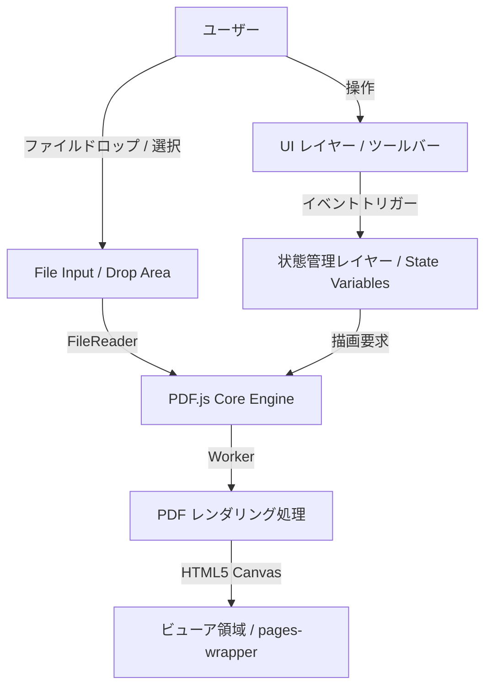

# PDF Viewer 設計仕様書

本ドキュメントは、ブラウザ上で動作する完全にローカルなPDFビューア（[pdf-viewer.html](file:///Users/yos/dev/pdf_viewer/pdf-viewer.html)）の設計仕様書です。

---

## 1. 概要

本システムは、サーバーへのファイルをアップロードすることなく、クライアントサイド（ブラウザ内）の処理のみでPDFファイルを閲覧できるシングルページのWebアプリケーションです。

### 1.1 主な特徴
- **完全ローカル処理**: FileReader API と PDF.js を用いることで、機密性の高いPDFファイルも外部に送信することなく安全に閲覧可能です。
- **高解像度対応**: ディスプレイのデバイスピクセル比率に応じた描画スケールの動的調整により、拡大時や高解像度ディスプレイでもテキストや画像が鮮明に表示されます。
- **効率的なメモリ管理**: `IntersectionObserver` を利用した遅延レンダリング（Lazy Rendering）により、大容量のPDFでもブラウザのメモリ消費を最小限に抑えます。

---

## 2. システム構成・アーキテクチャ

### 2.1 テクノロジースタック
- **フロントエンド**: HTML5, CSS3 (Webkitカスタムスクロールバー、レスポンシブ対応メディアクエリ), Vanilla JavaScript (ES6+)
- **コアライブラリ**: [PDF.js](https://mozilla.github.io/pdf.js/) (v3.11.174)
  - レンダリングの高速化とメインスレッドのブロッキング防止のため、`pdf.worker.js` を使用しています。

### 2.2 コンポーネント構成


---

## 3. UI/UX 設計

### 3.1 画面レイアウト
画面全体は `height: 100vh; display: flex; flex-direction: column;` で構成され、以下の3つの主要エリアに分かれます。

1.  **初期オーバーレイ（ドロップ領域）**: `#drop-overlay`
    - ファイルが読み込まれていない初期状態、または新しいファイルを開く際に表示される全画面エリア。ファイル選択用のダミー要素として動作します。
2.  **ツールバー**: `#toolbar`
    - 操作用のボタンやドロップダウンリストが配置されます。フレックスボックスにより、画面幅に応じて適切に折り返されます。
3.  **ビューア領域**: `#viewer-wrapper`
    - `#viewer-container` (スクロール可能領域) と `#pages-wrapper` (Canvasが描画されるコンテナ) で構成されます。

### 3.2 レスポンシブ設計
画面幅が `600px` 以下のモバイル環境では、メディアクエリによって以下の調整が行われます。
- ツールバーの余白（`padding`）を縮小し、中央揃えに配置。
- ボタンやセレクトボックスのフォントサイズを `13px` に縮小し、スマホ画面でのレイアウト崩れを防止。
- コンテナのパディングを削減し、表示領域を最大化。

---

## 4. 機能仕様

### 4.1 ファイルオープン機能
- **ドラッグ＆ドロップ**: 画面全体のどこにドロップしても読み込み可能。
- **ファイル選択**: 「Open File」ボタンからファイルダイアログを開いて選択。
- **バリデーション**: `application/pdf` 以外のファイル形式は警告を表示して処理を中断します。

### 4.2 閲覧モード・設定

| 設定項目 | 値 | 説明 |
| :--- | :--- | :--- |
| **スクロールモード** (`scrollMode`) | `page` / `scroll` | `page` は1ページ毎のめくり表示。`scroll` は全ページを縦に連結して表示。 |
| **表示モード** (`viewMode`) | `1` / `2` | `1` は単一ページ表示。`2` は見開き（2ページ並列）表示。 |
| **読書方向** (`readDir`) | `ltr` / `rtl` | `ltr` は左から右。`rtl` は右から左（マンガ・右綴じ本）。 |
| **フィットモード** (`fitMode`) | `auto` / `width` / `height` | `auto` は全体収まるよう自動調整。`width` は幅合わせ。`height` は高さ合わせ。 |

### 4.3 ユーザー操作インタラクション
- **物理ボタン**: ページ戻る/進む（1ページ単位、または現在の表示数単位）。
- **画面左右タップ**: 画面の左1/3をタップすると戻る（または進む）、右1/3をタップすると進む（または戻る）。
- **キーボードナビゲーション**: `ArrowLeft` および `ArrowRight` キーで前後のページへ移動可能。
- **読書方向（RTL）の統合**: RTL選択時は、ボタン・画面タップ・キーボードのすべての「進む/戻る」の物理的マッピングが逆転します。

---

## 5. 技術的アプローチの詳細

### 5.1 動的 Canvas 描画
PDFの描画は以下のプロセスで行われます。
1.  `pdfjsLib.getDocument()` でPDFをロード。
2.  `pdfDoc.getPage(pageNum)` で対象ページのオブジェクトを取得。
3.  `devicePixelRatio` と基準スケール（デフォルト 2.5倍）から最適な `viewport` を計算。
4.  `<canvas>` 要素を作成し、`width` / `height` を設定。
5.  `page.render()` を呼び出し、Canvas の 2D コンテキストに対して描画を実行。

### 5.2 縦スクロール時の IntersectionObserver 制御
`scrollMode = 'scroll'` が有効な場合、以下の2つの `IntersectionObserver` が機能します。

1.  **レンダリング監視用 (`scrollObserver`)**:
    - 各ページのプレースホルダ（`scroll-page-container`）を監視します。
    - 画面のスクロール領域に入った（または近づいた `rootMargin: '1000px'` 内）段階で `renderScrollPage()` が実行され、実際の Canvas へのレンダリングが始まります。
2.  **アクティブページ検出用 (`activePageObserver`)**:
    - 現在画面内に最も多く表示されているページを検知します。
    - 検出されたアクティブなページ番号に基づいて、ツールバーのページ表示（`#page-num`）がリアルタイムに更新されます。

---

## 6. データモデル・状態定義

アプリケーションのグローバルな状態は、以下のJavaScript変数で管理されます。

```javascript
let pdfDoc = null;             // PDFDocumentProxy オブジェクト
let pageNum = 1;               // 現在表示しているプライマリページ番号 (1から開始)
let isRendering = false;       // レンダリング処理中かどうかのフラグ
let nextRenderPageNum = null;  // レンダリング中に次のレンダリング要求があった場合の予約番号
let scale = ...;               // 描画倍率 (DPIに応じる)
let viewMode = 1;              // 表示モード (1: 単一, 2: 見開き)
let scrollMode = 'page';       // スクロールモード ('page', 'scroll')
let readDir = 'ltr';           // 読書方向 ('ltr', 'rtl')
let fitMode = 'auto';          // フィットモード ('auto', 'width', 'height')
let spreadOffset = 0;          // 見開き時のオフセット (0: 偶数開始, 1: 奇数開始)
```
